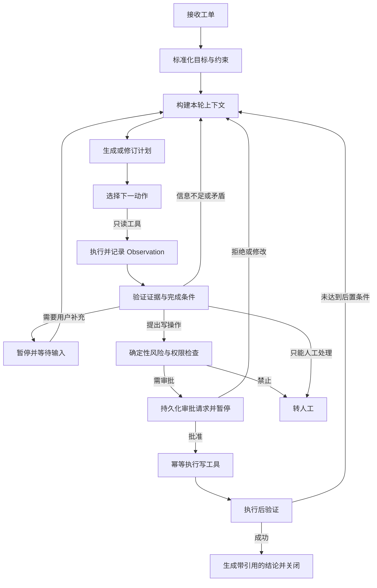

# 项目与架构蓝图

## 1. 真实问题定义

售后客服处理“未收到货、错发、破损、退款失败”等工单时，需要跨系统查订单、物流、支付记录和公司政策。问题不在于不会写回复，而在于：

- 信息分散，人工需要来回切换系统。
- 同一问题的证据获取顺序会随现场结果变化。
- 退款和补偿是高风险写操作，不能让模型直接执行。
- 处理过程必须可追溯，失败后必须能恢复。
- 模型效果不能靠主观感觉，需要和业务指标一起评估。

项目使用可重复的模拟订单、物流、支付和知识库服务，保证任何面试官都能本地复现。模拟数据不是假装真实收益：项目会明确区分“真实业务流程”和“合成测试数据”，只报告实际测得的技术指标。

## 2. 用户与核心用例

### 客服人员

- 创建或导入工单。
- 查看 Agent 当前计划、已收集证据和风险说明。
- 回答 Agent 的必要追问。
- 批准、拒绝或修改退款/补偿提案。
- 接管失败、冲突或低置信度工单。

### 主管/评估人员

- 查看成功率、升级率、平均工具调用数、成本和延迟。
- 回放失败轨迹并标注错误原因。
- 比较两个 Prompt、模型或检索版本的离线评估结果。

### 系统管理员

- 管理用户、角色、租户和工具权限。
- 管理政策文档的版本、有效期和访问范围。
- 查看审计日志和敏感操作记录。

## 3. Agent 状态机



每一步都必须有显式输入、输出、错误和转移条件。聊天历史只是原始事件之一，不等于 Agent 状态。

## 4. 后端模块边界

```text
Client / Approval Console
          |
FastAPI API Layer
          |
Application Services -----------------------------------------+
  Ticket | Run | Approval | Knowledge | Evaluation           |
          |                                                    |
Agent Runtime ---- Context Engine ---- Policy/Risk Engine      |
  Planner          Budget/Compress      RBAC/Amount/ACL        |
  Executor         Retrieve/Memory      Approval Rules         |
  Verifier                                                  Audit
          |                                                    |
Adapters: LLM | Tool Registry | MCP Client | Embedding | Rerank|
          |                                                    |
PostgreSQL + pgvector | Redis | Worker Queue | Object Storage--+
          |
OpenTelemetry -> Metrics / Traces / Logs -> Dashboard
```

### API 层

负责 HTTP 协议、认证、参数校验、错误映射、流式进度和请求 ID，不承载业务判断。

### Application Service 层

负责编排事务和用例，例如“创建工单并启动一次 Agent Run”“批准某次工具动作”。

### Agent Runtime

负责 plan → act → observe → verify 循环、最大步数、Token/时间预算、checkpoint、暂停、恢复和取消。

### Context Engine

不是简单拼接聊天记录，而是按优先级和预算构造上下文：

1. 不可覆盖的系统安全策略。
2. 当前任务目标、结构化状态和完成条件。
3. 已确认的用户事实与最新修改。
4. 与本步相关的工具定义。
5. 经过 ACL、时效性和可信度过滤的知识证据。
6. 压缩后的关键历史和可用长期记忆。

每个上下文片段记录来源、时间、可信级别、Token 数和被选择/丢弃原因。

### Policy/Risk Engine

权限和安全不能只写进 Prompt。代码必须再次检查租户、角色、金额、工具允许列表、审批状态和幂等键。

### Tool Layer

所有工具使用统一契约：名称、用途、JSON Schema、读写类型、风险等级、超时、重试策略、权限要求、幂等能力和标准错误码。模型永远不直接操作数据库。

## 5. 关键数据模型

- `users / roles / tenants`：身份与租户隔离。
- `tickets / ticket_events`：工单及不可变事件流。
- `agent_runs / run_steps / checkpoints`：一次运行、步骤与恢复点。
- `tool_calls / tool_results`：结构化工具调用、结果、版本和耗时。
- `approval_requests / approval_decisions`：审批内容、风险、决定和操作者。
- `knowledge_documents / chunks / embeddings`：文档、版本、ACL、有效期和向量。
- `memories`：主体、类型、来源、置信度、有效期和删除状态。
- `prompt_versions / model_configs`：可回放的运行配置。
- `eval_cases / eval_runs / eval_scores`：数据集、实验和各维度分数。
- `audit_events`：谁在何时对什么资源做了什么。

## 6. Agent 核心能力如何被证明

| 能力 | 可见行为 | 可评估证据 |
|---|---|---|
| 任务规划 | 根据工单类型生成不同调查步骤 | 计划合法率、无用步骤率 |
| 工具选择 | 随观察结果动态选择订单、物流、政策或退款工具 | 工具选择准确率、参数准确率 |
| 自我修正 | 证据冲突时改写查询或修订计划 | 冲突案例成功率、平均额外步数 |
| 状态与记忆 | 暂停恢复后保持目标，用户改口后更新事实 | 恢复一致性、陈旧事实使用率 |
| Agentic RAG | 判断是否检索、改写查询、重排并引用 | Recall@k、MRR、引用精确率、groundedness |
| 人机协同 | 风险动作暂停，支持批准/拒绝/修改/接管 | 审批召回率、未授权执行数 |
| 结果验证 | 执行退款后重新查询状态 | 后置条件验证覆盖率 |

## 7. 可观测性设计

一次请求使用同一 `trace_id` 串起 API、队列、Agent 节点、LLM、检索、工具和数据库。Span 至少记录：

- run/step/tool/prompt/model/version 标识；
- 输入输出摘要及脱敏状态；
- 延迟、Token、估算成本、重试次数；
- 检索文档 ID、分数、过滤原因；
- 状态转移、终止原因、错误类型；
- 审批等待时长和最终决定。

核心指标包括任务成功率、自动解决率、人工升级率、安全违规数、工具错误率、检索质量、p50/p95 延迟、每任务 Token/成本和恢复成功率。

## 8. 评估体系

### 确定性评估优先

- 是否调用了允许的工具。
- JSON 参数和业务关键字段是否正确。
- 是否在高风险动作前创建审批。
- 最终数据库状态是否满足后置条件。
- 引用的文档是否真实存在、有效且支持结论。

### 模型评估补充

LLM Judge 只评估难以写规则的维度，如解释是否完整、升级理由是否合理。Judge 必须保存 rubric 和版本，并用人工标注的小样本校准一致性，不能把它当绝对真值。

### 数据飞轮

线上/演示失败 → 人工归因 → 进入候选案例 → 去隐私和去重 → 人工审核 → 加入 Golden Dataset → 回归比较 → 只有指标通过才更新 Prompt/模型/检索版本。

## 9. 人机协同边界

- 只读、低风险、证据充分：Agent 可自主执行。
- 可逆但有业务影响：按策略决定是否抽检或审批。
- 退款、补偿、修改用户资产：强制审批。
- 信息冲突、低置信度、权限不足、安全攻击：转人工。
- 人可以批准、拒绝、修改提案、补充事实或直接接管；每种操作都形成新事件，不直接篡改历史。

## 10. 不做或延后

- 不在第一版做开放式多 Agent 群聊。
- 不把全部聊天记录无脑塞进上下文。
- 不让 LLM 直接生成并执行 SQL。
- 不在没有对照实验时声称微调或 RL 提升效果。
- 不为了“高并发”编造数字，只提交真实机器上的压测配置和报告。

